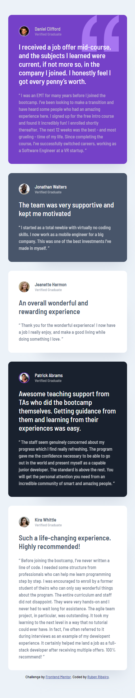

# Frontend Mentor - Testimonials grid section solution

This is a solution to the [Testimonials grid section challenge on Frontend Mentor](https://www.frontendmentor.io/challenges/testimonials-grid-section-Nnw6J7Un7). Frontend Mentor challenges help you improve your coding skills by building realistic projects. 

## Table of contents

- [Overview](#overview)
  - [The challenge](#the-challenge)
  - [Screenshots](#screenshots)
  - [Links](#links)
- [My process](#my-process)
  - [Built with](#built-with)
  - [What I learned](#what-i-learned)
  - [Continued development](#continued-development)
  - [Useful resources](#useful-resources)
- [Author](#author)

## Overview

### The challenge

Users should be able to:

- View the optimal layout for the site depending on their device's screen size

### Screenshots




### Links

- Solution URL: [https://github.com/RubenRibeiro13/testimonials-grid-section](https://github.com/RubenRibeiro13/testimonials-grid-section)
- Live Site URL: [https://rubenribeiro13.github.io/testimonials-grid-section](https://rubenribeiro13.github.io/testimonials-grid-section)

## My process

### Built with

- Semantic HTML5 markup
- CSS custom properties
- Flexbox
- CSS Grid

### What I learned

While working through this project, I learned the basics of CSS Grid, when to use the inline quotation element and the repeat CSS function, and how to set the opacity of an element.

```html

<q>
  Thank you for the wonderful experience! I now have a job I really enjoy, and make a good living
  while doing something I love.
</q>

```

```css

q {
  opacity: 0.7;
}

.main-container {
  display: grid;
  grid-template-columns: repeat(4, 255px);
  grid-gap: 25px 30px;
  justify-content: center;
}

.main-container {
  grid-template-columns: auto;
  justify-items: center;
}

.testimonial-container-5 {
  grid-column: 1 / 4;
  grid-row: 3 / 4;
}

```

### Continued development

In future projects, I want to continue focusing on CSS Grid. I also want my next project to require JavaScript.

### Useful resources

- [CSS-Tricks](https://css-tricks.com) - This resource helped me understand more about CSS Grid.
- [MDN Web Docs](https://developer.mozilla.org) - This is my go-to resource when I need to use a CSS property or function for the first time, such as opacity and repeat.
- [Stack Overflow](https://stackoverflow.com) - This resource showed me how to reduce the width of a Google Chrome window to below 500px, which is helpful when designing websites for small devices.

## Author

- Website - [Ruben Ribeiro](https://rubenribeiro13.github.io/my-site)
- Frontend Mentor - [@RubenRibeiro13](https://www.frontendmentor.io/profile/RubenRibeiro13)
